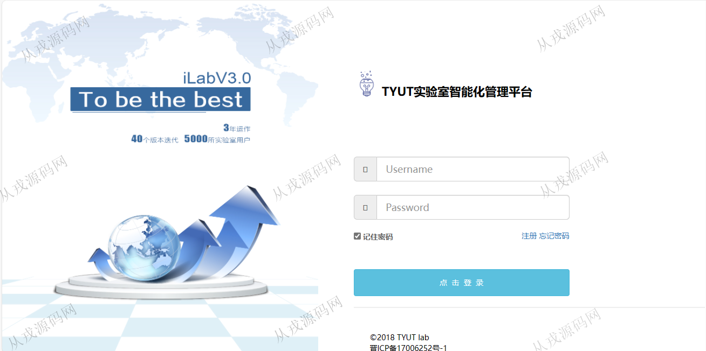
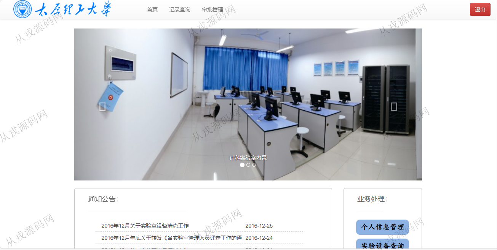
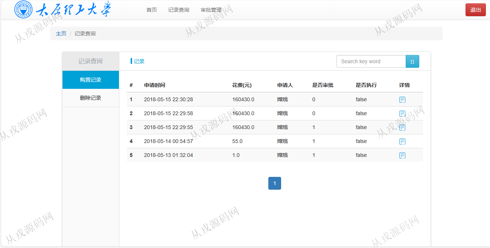
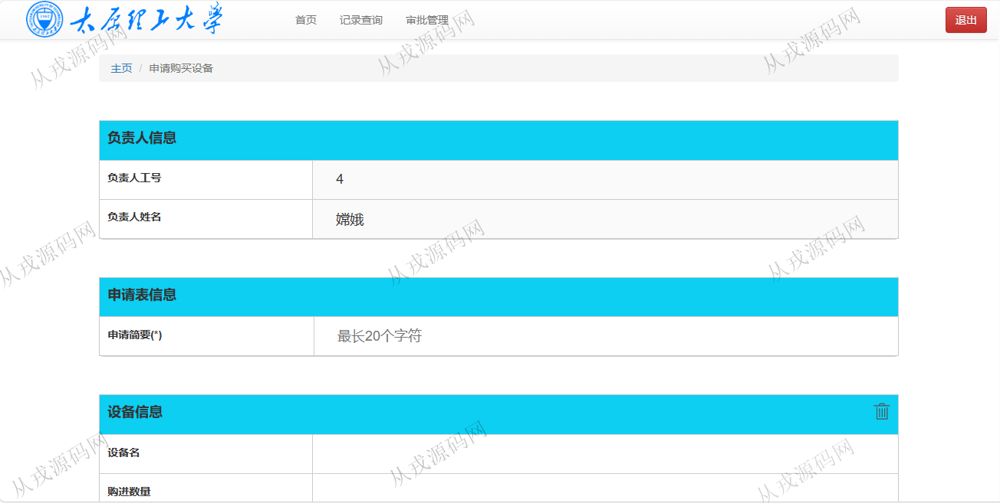
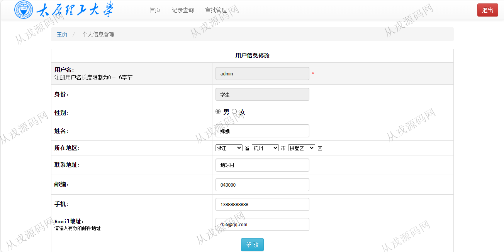
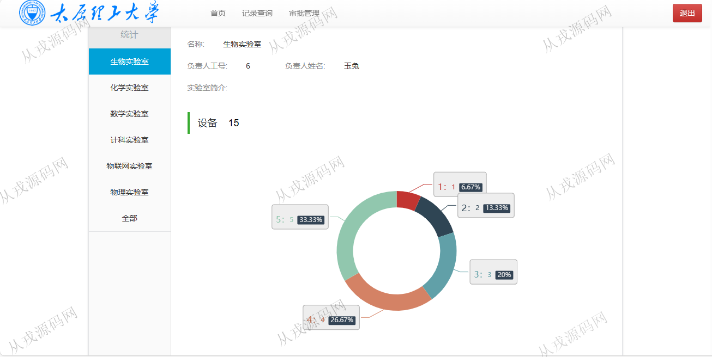
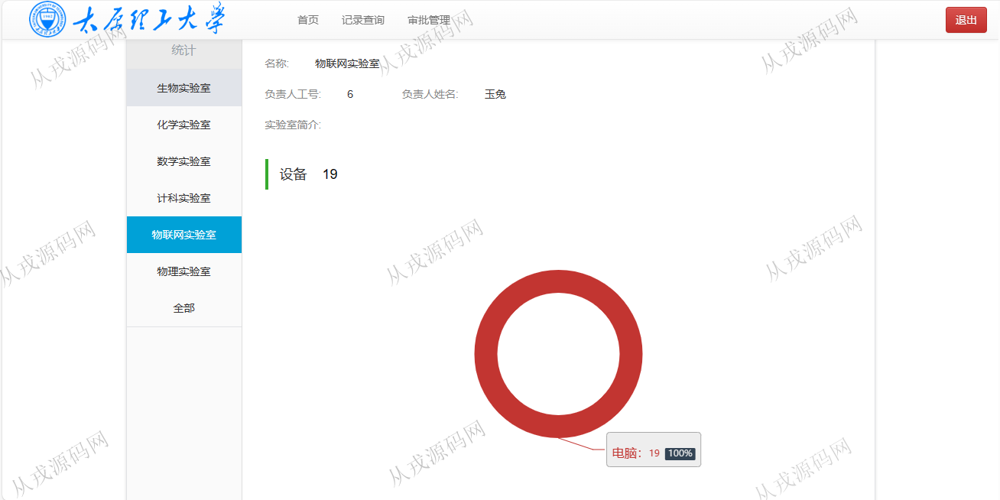
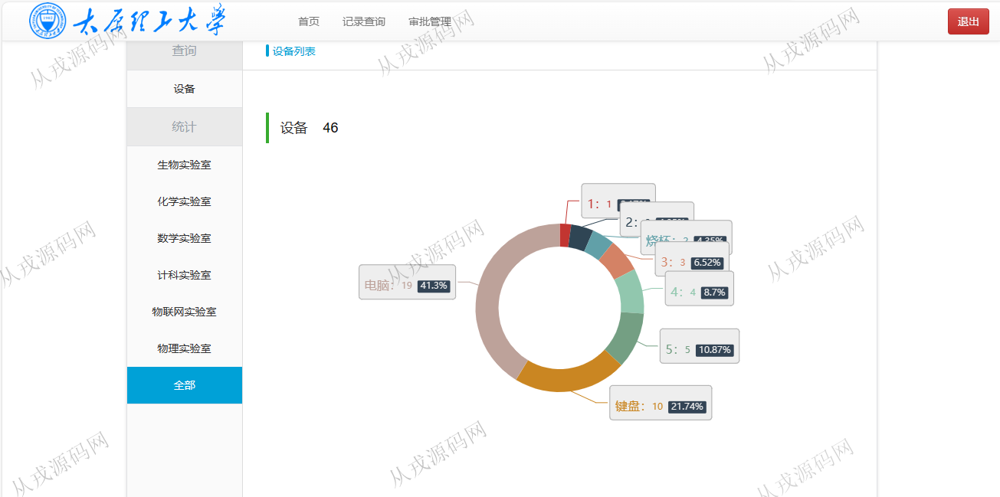

<h1 align="center">183.实验室智能化管理系统</h1>

 获取sql文件 QQ: 386869957 QQ群: 377586148 

 [更多源码项目: 从戎源码网](https://armycodes.com/) 

## 简介

> 本代码来源于网络,仅供学习参考使用!
>
> 提供1.远程部署/2.修改代码/3.设计文档指导/4.框架代码讲解等服务
> 
> 访问地址：http://localhost:8080/user/toLogin
> 
> admin 123456
> 

## 项目介绍
基于ssm的实验室智能化管理系统【含报告】：前端 jsp、jquery、bootstrap，后端 maven、springmvc、spring、mybatis；集成审批管理、实验室设备、设备统计等功能于一体的系统。

## 功能介绍

- 基本功能：登录，注册，退出
- 网站首页：主导航栏，轮播图，通知公告，业务处理
- 记录查询：购置记录查询，删除记录删除，关键词搜索
- 审批管理：购置审批查询，审批购置记录查询，关键词搜索
- 个人信息管理：个人信息查看与修改
- 实验室设备：设备列表查询，删除
- 设备统计：生物实验室、化学实验室、数学实验室、计科实验室、物联网实验室、物理实验室

## 环境

- <b>IntelliJ IDEA 2021.3</b>

- <b>Mysql 5.7.26</b>

- <b>Tomcat 7.0.73</b>

- <b>JDK 1.8</b>

## 运行截图

