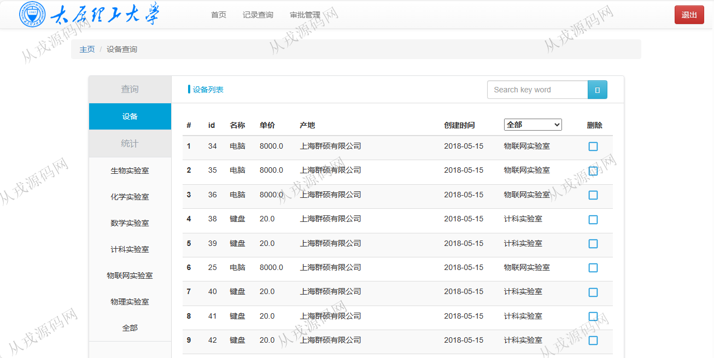

<h1 align="center">183.实验室智能化管理系统</h1>

- <b>完整代码获取地址：从戎源码网 ([https://armycodes.com/](https://armycodes.com/))</b>
- <b>技术探讨、资料分享，请加QQ群：692619798</b> 
- <b>作者微信：19941326836  QQ：952045282</b> 
- <b>承接计算机毕业设计、Java毕业设计、Python毕业设计、深度学习、机器学习</b>
- <b>选题+开题报告+任务书+程序定制+安装调试+论文+答辩ppt 一条龙服务</b>
- <b>所有选题地址 ([https://github.com/YuLin-Coder/AllProjectCatalog](https://github.com/YuLin-Coder/AllProjectCatalog)) </b>

## 项目介绍
基于ssm的实验室智能化管理系统【含报告】：前端 jsp、jquery、bootstrap，后端 maven、springmvc、spring、mybatis；集成审批管理、实验室设备、设备统计等功能于一体的系统。

## 功能介绍

- 基本功能：登录，注册，退出
- 网站首页：主导航栏，轮播图，通知公告，业务处理
- 记录查询：购置记录查询，删除记录删除，关键词搜索
- 审批管理：购置审批查询，审批购置记录查询，关键词搜索
- 个人信息管理：个人信息查看与修改
- 实验室设备：设备列表查询，删除
- 设备统计：生物实验室、化学实验室、数学实验室、计科实验室、物联网实验室、物理实验室

## 环境

- <b>IntelliJ IDEA 2021.3</b>

- <b>Mysql 5.7.26</b>

- <b>Tomcat 7.0.73</b>

- <b>JDK 1.8</b>

## 运行截图

